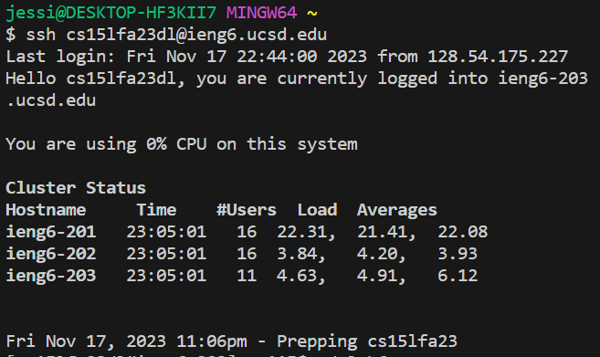
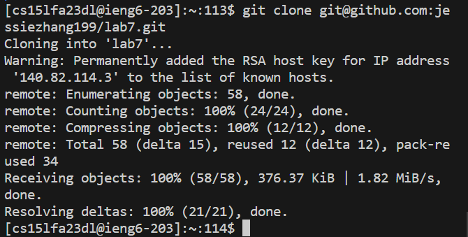
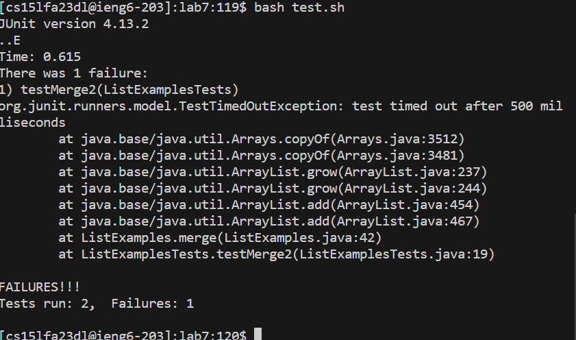
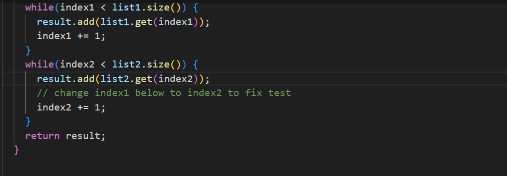
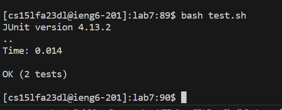
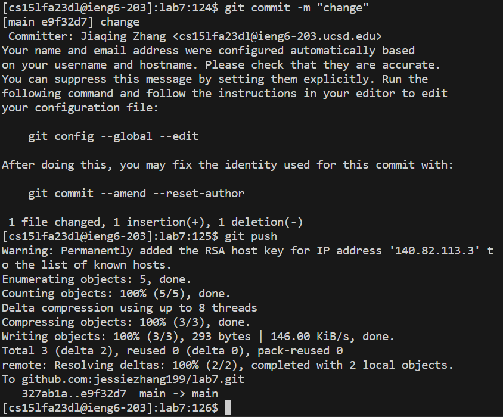

## Log into ieng6
I login in to my ieng6 account by typing 'ssh ' and <Ctrl>v to paste my ieng6 address and then <enter> to run the command.
### code
login in to ieng6 account
`ssh<space><Ctrl>v`

## Clone your fork of the repository from your Github account (using the SSH URL)
And then clone the link by using 'git clone ' and copy the path of my ssh url of the lab7 on my account after I set up all the public key. 
### code
clone to my java editor
`git<space>clone<space><ctrl>v<enter>`

## step 6
I cd into the lab7 directory and run the test.sh by using the command bash test.sh. It shows sthat there are two tests run but one fail. 
### code
cd the directory
`cd<space>lab7<enter>`
test the file to see if there is any error.
`bash<space>test.sh<enter>`

## step 7
I using the vim ListExample.java command to open vim on ListExample.java and try to fix the code. I pressed a lot of j in order to go to the very end of the code that need to be changed and pressed l to the index1 +=1 place and place in the index1 on the 1. And then I press dw to delete 1, and press i into insert mode and type 2 to make changes and than Press Esc to escape from the insert mode. I also use type :wq<enter> to save all the changes and than exit vim.
### code
Open the file using vim to edit.
`vim ListExample.java`
Go down to the place that I need to edit and make editions.
`jjjjjjjjjjjjjjjjjjllllldwi2<Esc>:wq<enter>`

## step 8
I run the test by using the command bash test.sh, and it shows all the test is passed after I changed the code using vim.
`bash<space>test.sh<enter>`

## step 9
I use the command git add ListExample.java to add it to the commit and than commit it and push it to the githug account I have by using the code below.
### code
Add the new change file:
`git<space>add<space>ListExamples.java<enter>`
Commit the change file with the message change.
`git<space>commit<space>-m "change"<enter>`
Push the new changed file to my git hug account.
`git<space>push`

